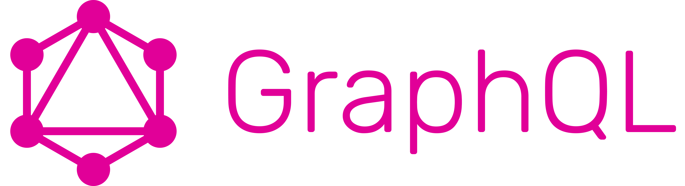
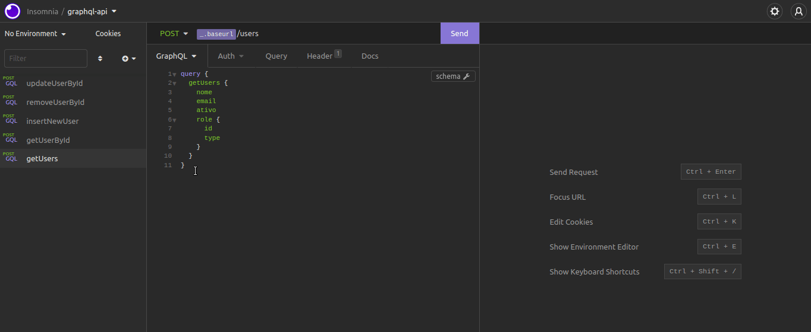

<h1 align="center">
    
</h1>

<h2 align="center">graphql-api</h2>

  API com CRUD desenvolvida durante o curso <strong>Alura</strong>:</br>
 
 - [GraphQL: construindo uma API com Apollo Server](https://cursos.alura.com.br/course/graphql-construindo-api-apollo-server)

## :dart: Índice
- [Status](#status)
- [Tecnologias](#tecnologias)
- [Pré-Requisitos](#pre-requisitos)
- [Executando o projeto](#executando-o-projeto)
- [Licença](#licença)

## :game_die: Status
<p align="center">
  
  
  
  
</p>

## :toolbox: Tecnologias
- [node.js](https://nodejs.org/)
- [graphql](https://www.npmjs.com/package/graphql)
- [apollo-server](https://www.npmjs.com/package/apollo-server)
- [apollo-datasource-rest](https://www.npmjs.com/package/apollo-datasource-rest)
- [json-server](https://www.npmjs.com/package/json-server)

## :heavy_check_mark: Pré-requisitos
Antes de iniciar, certifique-se que tenha instalado em seu computador as seguintes ferramentas:
- [Node.js](https://nodejs.org/)
- [Npm](https://www.npmjs.com/)
- [Visual Studio Code](https://visualstudio.microsoft.com/pt-br/)
- [Insomnia](https://insomnia.rest/)

## :gear: Executando o projeto

1. *Faça o clone do repositório:*

```sh
$ git clone https://github.com/LuizEduardoBilotta/graphql-api
```

2. *Instale as depêndencias do projeto:*

```sh
# Acesse o diretório do projeto:
$ cd graphql-api

# Instale as dependências:
$ npm install
```

3. *Execute o servidor de dados JSON:*
```sh
$ npm run server
```

4. *Abra um novo terminal no mesmo diretório e execute a aplicação:*
```sh
$ npm start
```

## :repeat: Executando as requisições para o servidor
1. *_Playground_ do Apollo-Server (Primeira opção):*
Após iniciar o servidor, acesso o endereço `localhost:4000` em seu navegador conforme mostra a imagem abaixo. Depois é só montar suas queries conforme achar necessário.

<h1 align="center">
    
</h1>

2. *Insomnia (Segunda opção):*
Importe o arquivo `Insomnia-requests.json` no Insomnia, todas as requisições do CRUD estarão disponíveis para realizar seus testes conforme imagem abaixo.

<h1 align="center">
    
</h1>

## :floppy_disk: Dados
Caso queira alterar os dados, acesse o diretório `api/data/dados.json` e realizar as alterações necessárias.

## :bookmark_tabs: Licença
Este projeto está licenciado nos termos da licença MIT. Veja o arquivo [LICENSE](./LICENSE) para mais detalhes.

## :jigsaw: Contato
- :mailbox_with_mail: E-mail: <a href="mailto:luizeduardobilotta@gmail.com">luizeduardobilotta@gmail.com</a>
- :pushpin: Linkedin: [in/luizeduardobilotta](https://www.linkedin.com/in/luizeduardobilotta)

<sup>Desenvolvido por <i><strong>Luiz Eduardo Bilotta.</i></strong></sup>


